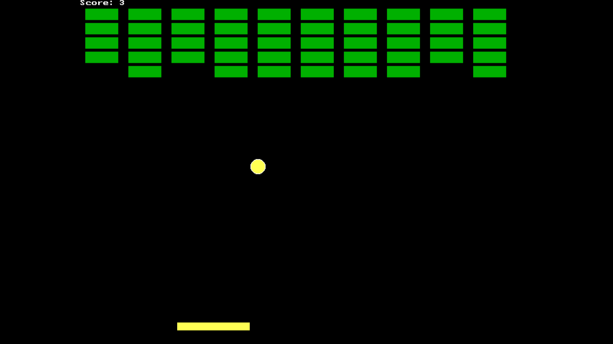

# Brick Breaking Game

## Overview

The Brick Breaking Game is a classic arcade-style game built in C using the graphics library. The objective of the game is to destroy all the bricks by bouncing a ball off a paddle. The player controls the paddle's horizontal movement to keep the ball in play and aim for the highest score.

## Here's an overview of the key components and how the game works:

- **Initialization (`initialize()`):**
  
  - This function initializes the game by setting up the initial positions of the paddle, ball, and bricks.
  - It also initializes an array called bricks to keep track of the status of each brick (1 if the brick is still active, 0 if it's been destroyed).
    
- **Drawing (`draw()`):**
  
  - This function is responsible for drawing the game's elements on the screen.
  - It clears the screen, then draws the paddle and ball.
  - It also draws the bricks based on the bricks array.
  - Finally, it displays the player's score at the top of the screen.
    
- **Input Handling (`input()`):**
  
  - This function checks for keyboard input (left and right arrow keys) using `kbhit()` and adjusts the paddle's position accordingly.
  - It ensures that the paddle does not go beyond the screen boundaries.
    
- **Movement (`move()`):**
  
  - This function updates the position of the ball.
  - It checks for collisions with the paddle and the bricks:
  - If the ball hits the paddle, it changes its direction vertically (bounces off).
  - If the ball hits a brick, it marks the brick as "destroyed" in the bricks array, changes the ball's direction, and increments the player's score.
  - It also handles ball boundary collisions and detects if the player has won or lost the game.
    
- **Main Function (`main()`):**
  
  - The main function initializes the graphics system and enters the game loop.
  - In the game loop, it repeatedly calls the `move()`, `input()`, and `draw()` `functions`, `creating` the animation.
  - It uses `delay(10)` to control the speed of the game.
    

## How to Play

- **Controls:**
  - Use the left and right arrow keys to move the paddle horizontally.
  - Press any key to start the game.

- **Gameplay:**
  - The ball will bounce off the paddle and the walls.
  - Destroy all the bricks by hitting them with the ball.
  - If the ball falls below the paddle, the game is over.
  - Your goal is to destroy all the bricks and achieve the highest possible score.

- **Win Condition:**
  - Destroy all 50 bricks to win the game.
  - If you reach this goal, you'll see a "Congratulations!" message.

- **Lose Condition:**
  - If the ball falls below the paddle, the game is over.
  - You'll see a "Game Over" message, and you can exit the game by pressing any key.

## How to Run

1. Clone or download the repository to your local machine.
2. Compile the code using a C/C++ compiler (e.g., Turbo C++).
3. Run the compiled executable.
4. Use the left and right arrow keys to control the paddle.

## Acknowledgments

This project was created as part of a programming exercise and serves as a basic example of a brick-breaking game in C.
